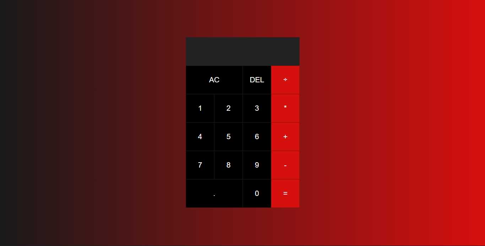

<h1 align="center">Calculadora com responsividade</h1> 

## :books: Funcionalidades
* <b>Soma</b>
* <b>Subtrai</b>
* <b>Dividi</b>
* <b>Multiplica</b>

## :wrench: Tecnologias utilizadas
* JavaScript
* HTML
* CSS

## :rocket: Rodando o projeto
Para rodar o repositório é necessário clonar o mesmo, dar o seguinte comando para iniciar o projeto:  
<a href="https://github.com/eaealana/Calculadora">https://github.com/eaealana/Calculadora</a>

## 💻 Projeto

## :dart: Status

